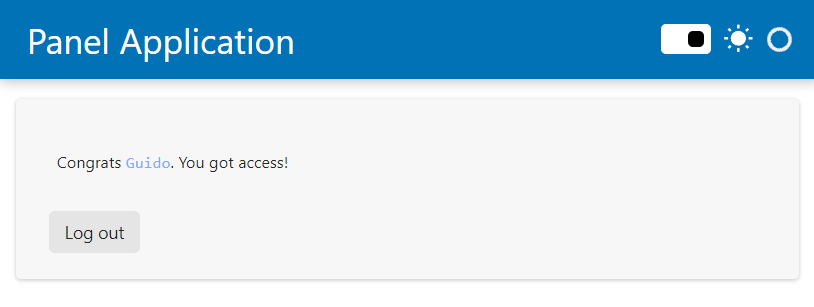

# Configuring Basic Authentication

For simple uses cases it may be totally sufficient to enable a basic Auth provider, which simply compares the provided login credentials against a master password or credentials stored in a file.

## Setting up basic authentication

Basic authentication can be set up simply by providing the `--basic-auth` commandline argument (or the `PANEL_BASIC_AUTH` environment variable). Here is how to do it:

Create a basic `app.py` file.

```python
import panel as pn

pn.extension(template="fast")

logout = pn.widgets.Button(name="Log out")
logout.js_on_click(code="""window.location.href = './logout'""")
pn.Column(f"Congrats `{pn.state.user}`. You got access!", logout).servable()
```

Now serve the application

```bash
panel serve app.py --basic-auth my_password --cookie-secret my_super_safe_cookie_secret
```

When loading the application you should now see a very simple login form:


If you enter an invalid password it will look like


If you enter a valid password it will look like



If you click the *Log out* button you will be sent back to the log in form.

In this mode the `username` is not authenticated. The `username` is provided as part of the [user info](user_info.md).

## User credentials

If you want a slightly more complex setup with a number of different users with potentially different access controls you can also provide a path to a file containing user credentials, e.g. let's say we have a file called `credentials.json` containing:

```json
{
    "user1": "my_password",
    "admin": "my_super_safe_password"
}
```

We can now configure the basic authentication with:

```bash
panel serve app.py --basic-auth credentials.json --cookie-secret my_super_safe_cookie_secret
```

The basic auth provider will now check the provided credentials against the credentials declared in this file.

:::note
When serving an application dynamically using `pn.serve` you can also provide a dictionary of usernames and passwords via the `basic_auth` keyword argument.
:::

## Custom templates

```{admonition} Prerequisites
For a more in-depth understanding of custom template take a look at the [how to > Build a Custom Template](../templates/template_custom.md) guide.
```

If you want to customize the authentication template you can provide a custom template with the `--basic-login-template` CLI argument. The template needs to submit `username` and `password` to the `/login` endpoint of the Panel server, e.g. the form of the default template looks like this. Check out the default template [here](https://github.com/holoviz/panel/blob/main/panel/_templates/basic_login.html) for inspiration.
